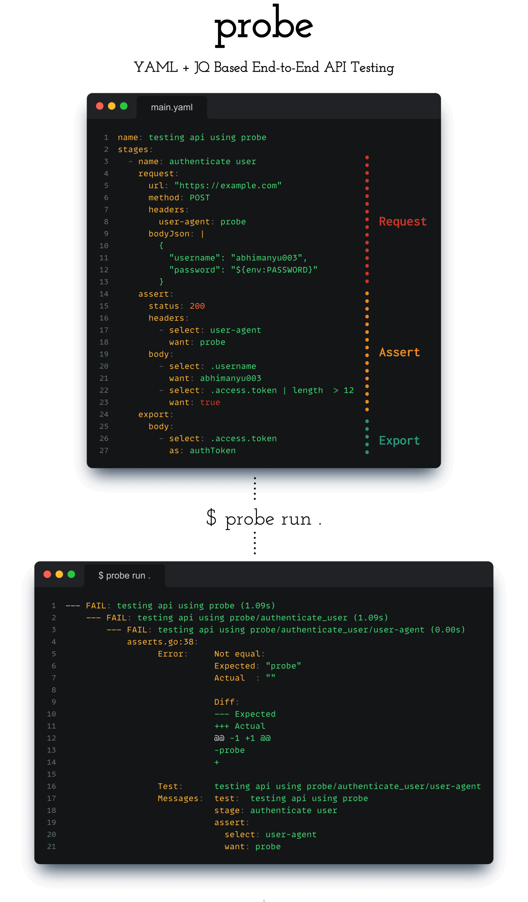

# Probe

Simplified End-to-End Test Using YAML and JQ.

**Full documentation is available on the official website: https://abhimanyu003.github.io/probe/**




## :battery: Install Probe

Probe support wide variety of OS
* 'linux', 'darwin', 'windows'
* '386', 'amd64', 'arm64'

#### Auto Install

```
curl -L https://raw.githubusercontent.com/abhimanyu003/probe/main/install.sh | bash
```

*This script installs the latest release by default.*

#### Brew

```
brew install abhimanyu003/tap/probe
```

#### Scoop

```
scoop bucket add probe https://github.com/abhimanyu003/scoop-bucket.git
scoop install probe
```

#### Arch Linux

```
yay -S probe-bin
```

#### Snap

> At this point we have to alias while using snap

```
sudo snap install go-probe
sudo snap alias go-probe.probe probe
```

#### Go Install

```
go install github.com/abhimanyu003/probe@latest
```

#### wget

Use wget to download, gzipped pre-compiled binaries.

For instance, `VERSION=v0.0.1` and `BINARY=probe_0.0.1_linux_amd64`

```
wget https://github.com/abhimanyu003/probe/releases/download/${VERSION}/${BINARY}.tar.gz -O - |\
  tar xz && mv probe /usr/bin/probe
```

You can find list of binary and release over [Release Page!](https://github.com/abhimanyu003/probe/releases)

#### Manually

Download the pre-compiled binaries from the [Release!](https://github.com/abhimanyu003/probe/releases) page and copy them
to the desired location.

You can download
* DEB
* RPM
* Pre-compiled binary

Visit [Release!](https://github.com/abhimanyu003/probe/releases)

## :boom: Usages

**Full documentation is available on the official website: https://abhimanyu003.github.io/probe/**


**Quick Example**

* Create `main.yaml` file

```yaml
name: Writing Test
stages:
  - name: first stage
    request:
      url: "https://httpbin.org/get"
      method: GET
    assert:
      status: 200
```

* Run
```
probe run main.yaml
```

## Examples

Here are some quick example that shows how you can use probe with YAML + JQ.
This will help you get some quick idea on how you can write your API tests

##### JQ Example

```yaml
name: JQ Example
stages:
  - name: get products request
    request:
      url: "https://dummyjson.com/products"
      method: GET
    assert:
      status: 200
      body:
        - select: .products | length
          want: 50

        - select: .products[0].id | isnormal
          want: true

        - select: .products[0].images | length
          want: 5

        - select: .products[] | select(.title == "iPhone 9") | .id
          want: 1
```


#### Form Data


```yaml
name: Form Data
stages:
  - name: add product
    request:
      url: "https://dummyjson.com/products/add"
      method: POST
      headers:
        Content-Type: 'application/json'
      formData:
        title: 'BMW Pencil'
    assert:
      status: 200
      body:
        - select: .id
          want: 101
```


## Contribution

This project welcomes your PR and issues. For example, refactoring, adding features, correcting English, etc. 

A quick development guide can be found on. [Developer-Guides](https://github.com/abhimanyu003/probe/wiki/Developer-Guides) wiki page.

If you need any help, you can contact me on [Twitter](https://twitter.com/abhimanyu003).

Thanks to all the people who already contributed and libraries imported in [go.mod](./go.mod)

<a href="https://github.com/abhimanyu003/probe/graphs/contributors">
  
</a>

## License

[MIT](./LICENSE)
